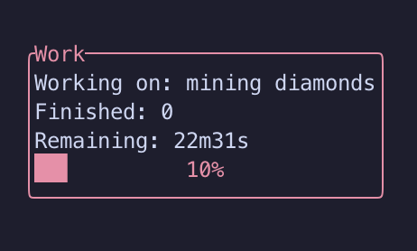

# pogodoro — A poggers-as-hell terminal UI pomodoro timer




## Installation

This is a Rust package, and I haven't prebuilt any binaries, so will need to be compiled. 
`rustup` (the Rust version manager) can be installed [here](https://www.rust-lang.org/learn/get-started).

I'm working on a cleaner way of doing this, but for the time being, installation also requires `sqlx-cli`:
```bash
cargo install sqlx-cli
```

From here we can proceed with actual installation:
```bash
git clone https://github.com/joshcbrown/pogodoro.git
sqlx db create # important!
cd pogodoro
cargo install --path .
```

## Usage

Big shoutout to [orhun](https://github.com/orhun/)'s [tui-rs template](https://github.com/orhun/rust-tui-template), which I am using as a base for this project.

